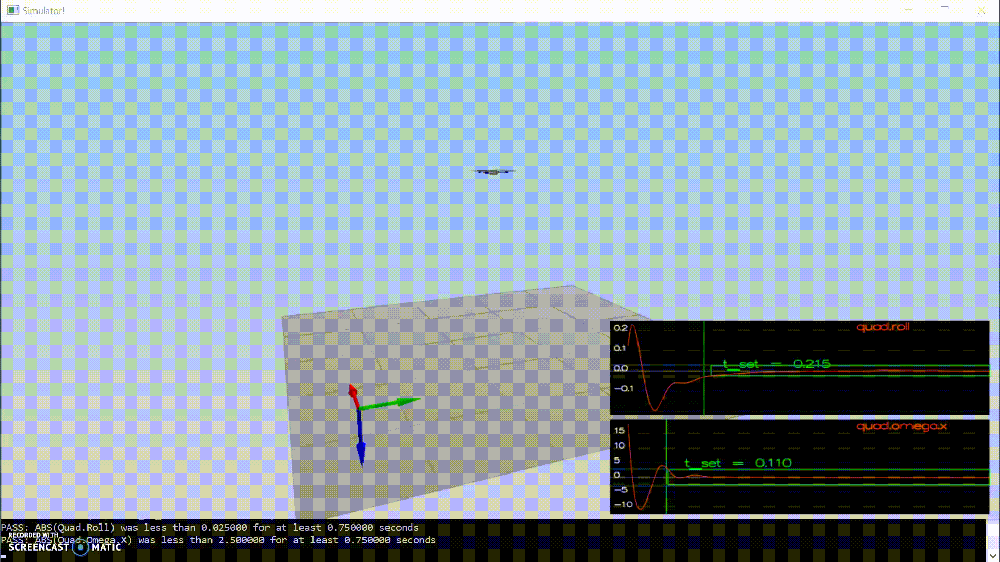
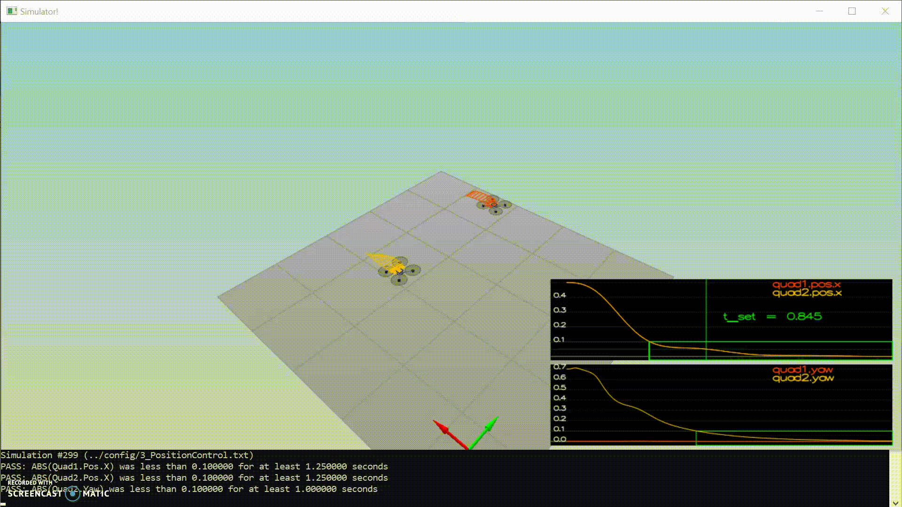

# The C++ Project Readme #

This is the readme for the C++ project.

For easy navigation throughout this document, here is an outline:

 - [Development environment setup](#development-environment-setup)
 - [Simulator walkthrough](#simulator-walkthrough)
 - [The tasks](#the-tasks)
 - [Evaluation](#evaluation)


## Development Environment Setup ##

Regardless of your development platform, the first step is to download or clone this repository.

Once you have the code for the simulator, you will need to install the necessary compiler and IDE necessary for running the simulator.

Here are the setup and install instructions for each of the recommended IDEs for each different OS options:

### Windows ###

For Windows, the recommended IDE is Visual Studio.  Here are the steps required for getting the project up and running using Visual Studio.

1. Download and install [Visual Studio](https://www.visualstudio.com/vs/community/)
2. Select *Open Project / Solution* and open `<simulator>/project/Simulator.sln`
3. From the *Project* menu, select the *Retarget solution* option and select the Windows SDK that is installed on your computer (this should have been installed when installing Visual Studio or upon opening of the project).
4. Make sure platform matches the flavor of Windows you are using (x86 or x64). The platform is visible next to the green play button in the Visual Studio toolbar:


5. To compile and run the project / simulator, simply click on the green play button at the top of the screen.  When you run the simulator, you should see a single quadcopter, falling down.


## Simulator Walkthrough ##

Now that you have all the code on your computer and the simulator running, let's walk through some of the elements of the code and the simulator itself.

### The Code ###

For the project, the majority of your code is written in `src/QuadControl.cpp`.  This file contains all of the code for the controller that you will be developing.

All the configuration files for your controller and the vehicle are in the `config` directory.  For example, for all your control gains and other desired tuning parameters, there is a config file called `QuadControlParams.txt` set up.  An import note is that while the simulator is running, this file can be edited in real time and see the effects on the quad!


By using the simulator different trajectories can be used to test out the performance of your C++ implementation of the controller. These trajectories, along with supporting code, are found in the `traj` directory of the repo.


### Testing it Out ###

When you run the simulator, you'll notice your quad is falling straight down.  This is due to the fact that the thrusts are simply being set to:

```
QuadControlParams.Mass * 9.81 / 4
```

Therefore, if the mass doesn't match the actual mass of the quad, it'll fall down.  Take a moment to tune the `Mass` parameter in `QuadControlParams.txt` to make the vehicle more or less stay in the same spot.

Note: if you want to come back to this later, this scenario is "1_Intro".

With the proper mass, your simulation should look a little like this:

<p align="center">

</p>


## The Tasks ##

For this project, I buildt a controller in C++.  

I was helpful to consult the [Python controller code](https://github.com/udacity/FCND-Controls/blob/solution/controller.py) as a reference. I inserted a comparable python code as comment above the C++ code. In the next section I just reference to the inital task and present a short screencast of the Quad behaviour. 
The main steps where the same for all parts of the controler:
 - convert the python code into runing C++ code
 - adapt the control parameter(s) to pass the Secenario


### Body rate and roll/pitch control (scenario 2) ###

1. Implementation of body rate control
2. Implementation of roll / pitch control

Quad behaviour
<p align="center">

</p>


### Position/velocity and yaw angle control (scenario 3) ###

1. Implementation of Lateral Position Control
   Implementation of Altitude Control
2. Implementation of Yaw Control

Quad behaviour
<p align="center">

</p>

### Non-idealities and robustness (scenario 4) ###

Adaption of Altitude Control 

Comment: In addtion to adapt the controler I also increased the inital mass of the quad so that the "real" mass and the assumed mass of the quad are closer. This leads to a little overcontrol in the 2 left cases, but in total to a sufficant solution. 

Quad behaviour
<p align="center">

</p>


### Tracking trajectories ###

Quad behaviour
<p align="center">

</p>
